<div align="center">

# 👋 Hi, I'm Mubeen Amjad

<a href="https://readme-typing-svg.demolab.com/">
  
</a>

<p>
  <a href="https://github.com/mubeen11222">
    
  </a>
  <a href="https://github.com/mubeen11222?tab=repositories">
    
  </a>
  <a href="https://www.linkedin.com/in/mubeenamjad400">
    
  </a>
</p>

</div>

---

## 👨‍💻 About Me

I'm **Mubeen Amjad**, a Computer Science student at **Air University, Islamabad**, passionate about software development, web technologies, and artificial intelligence.

I enjoy turning ideas into practical projects and continuously improving my programming and problem-solving skills.

* 🎓 BS Computer Science student at Air University
* 🌐 Interested in frontend and web development
* 🐍 Currently strengthening my Python skills
* 🤖 Working toward becoming an AI Engineer
* 💻 Experienced with C++, Java, HTML, CSS and JavaScript
* 🎨 Background in graphic design and visual communication
* 🚀 Interested in building useful, real-world software
* 📚 Always learning something new

---

## 🛠️ Tech Stack

### 💻 Programming Languages

<p>
  
</p>

### 🌐 Web Development

<p>
  
</p>

### 🔧 Tools & Technologies

<p>
  
</p>

### 🎨 Design

<p>
  
</p>

**Also:** CorelDRAW

---

## 🚀 Featured Projects

### 🌿 Swat Herbs — E-Commerce Website

**Independent Project**

A fully responsive e-commerce website developed independently from concept to deployment.

**Highlights:**

* 🎨 Designed and developed the complete website
* 📱 Responsive design for different screen sizes
* ⚡ JavaScript functionality
* 📧 Integrated EmailJS for automated order-confirmation emails
* 🔧 Managed development using Git and GitHub
* 🚀 Deployed using GitHub Pages

**Technologies:** `HTML5` `CSS3` `JavaScript` `EmailJS` `GitHub Pages`

---

### 🌱 Seeds Garden — E-Commerce Website

**3-Member Team Project**

A functional e-commerce website developed as a university team project.

**My contributions:**

* 🏠 Developed the Home page
* 🔐 Developed Login/Signup functionality
* 🤝 Collaborated using Git and GitHub
* 🌿 Researched and organized product information

**Technologies:** `HTML5` `CSS3` `Git` `GitHub`

---

### 🏋️ Gym Management System

**Java Project**

A Java-based project developed as part of my Object-Oriented Programming studies.

**Technologies:** `Java` `OOP`

---

### 📦 Parcel Weight & Cost Calculator

**C++ Project**

A Programming Fundamentals project developed in C++ for calculating parcel-related costs based on weight and other inputs.

**Technologies:** `C++`

---

## 📚 Currently Learning

I'm currently building the foundations required for my long-term goal of becoming an **AI Engineer**.

```text
Python
  ↓
Python OOP
  ↓
NumPy • Pandas • Matplotlib
  ↓
Linear Algebra • Calculus • Probability & Statistics
  ↓
Data Structures & Algorithms
  ↓
Machine Learning
  ↓
Deep Learning
  ↓
AI Engineering
```

### 🔥 Current Focus

* 🐍 Python & Python OOP
* 🧩 Python Data Structures
* 📊 NumPy, Pandas & Matplotlib
* 🧠 Data Structures & Algorithms in C++
* 🧮 Mathematics for AI/ML
* 🤖 Machine Learning & Deep Learning

---

## 🎯 Goals

My long-term goal is to become a strong **AI Engineer** capable of designing, developing, and deploying useful AI-powered products.

I'm especially interested in:

* Artificial Intelligence
* Machine Learning
* Deep Learning
* Generative AI
* AI-powered applications
* Software Engineering
* Building real-world products

---

## 📊 GitHub Stats

<div align="center">




</div>

---

## 🐍 Contribution Graph

<div align="center">


</div>

---

## 🤝 Let's Connect

<div align="center">

<a href="https://www.linkedin.com/in/mubeenamjad400">
  
</a>

<a href="mailto:mubeenmkd400@gmail.com">
  
</a>

<a href="https://github.com/mubeen11222">
  
</a>

</div>

---

<div align="center">

### 💡 Learn • Build • Improve • Repeat 🚀

⭐ Thanks for visiting my profile!

</div>

